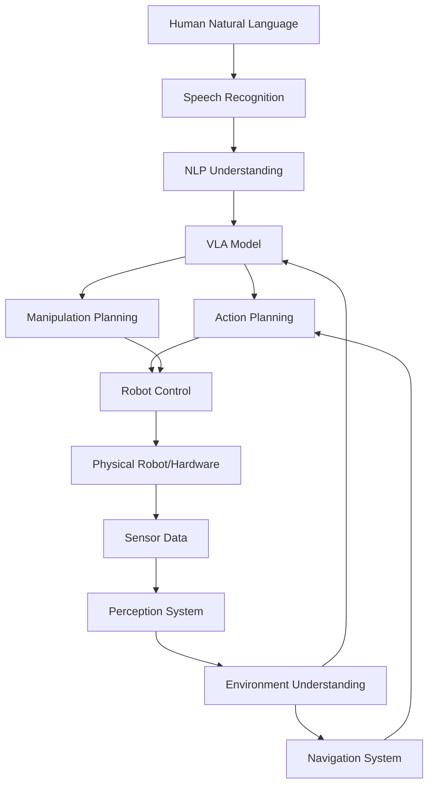

# Autonomous Humanoid Capstone

This capstone project integrates all concepts learned throughout the textbook to create an autonomous humanoid robot capable of understanding natural language commands, navigating environments, and performing complex manipulation tasks.

## Project Overview

In this capstone project, we'll build a complete autonomous humanoid system that combines:

- **ROS 2** for robot communication and control
- **Gazebo/Isaac Sim** for simulation and testing
- **Vision-Language-Action (VLA)** models for natural interaction
- **Perception systems** for environment understanding
- **Navigation and manipulation** capabilities

## System Architecture



## Implementation Steps

### Step 1: Environment Setup
First, set up your development environment with all required components:

```bash
# Create a new ROS 2 workspace for the humanoid project
mkdir -p ~/humanoid_ws/src
cd ~/humanoid_ws

# Source ROS 2
source /opt/ros/humble/setup.bash

# Create the main humanoid package
ros2 pkg create --build-type ament_python humanoid_brain
```

### Step 2: ROS 2 Node Integration
Create the main control node that integrates all components:

```python
#!/usr/bin/env python3
import rclpy
from rclpy.node import Node
from sensor_msgs.msg import Image, JointState
from geometry_msgs.msg import Twist
from std_msgs.msg import String
from builtin_interfaces.msg import Time
import numpy as np

class HumanoidBrain(Node):
    def __init__(self):
        super().__init__('humanoid_brain')

        # Publishers
        self.cmd_vel_pub = self.create_publisher(Twist, '/cmd_vel', 10)
        self.speech_pub = self.create_publisher(String, '/tts', 10)

        # Subscribers
        self.image_sub = self.create_subscription(
            Image, '/camera/rgb/image_raw', self.image_callback, 10)
        self.joint_sub = self.create_subscription(
            JointState, '/joint_states', self.joint_callback, 10)
        self.command_sub = self.create_subscription(
            String, '/voice_command', self.command_callback, 10)

        # Initialize AI components
        self.vla_model = None  # Initialize your VLA model
        self.navigation_system = None  # Initialize navigation
        self.manipulation_system = None  # Initialize manipulation

        self.get_logger().info('Humanoid Brain initialized')

    def image_callback(self, msg):
        """Process incoming camera images"""
        # Convert ROS Image to format suitable for VLA model
        # Process image through perception pipeline
        pass

    def joint_callback(self, msg):
        """Process joint state information"""
        # Update robot state for planning
        pass

    def command_callback(self, msg):
        """Process natural language commands"""
        command = msg.data
        self.process_natural_command(command)

    def process_natural_command(self, command):
        """Process a natural language command through the full pipeline"""
        # 1. Parse command using NLP
        parsed_command = self.parse_command(command)

        # 2. Plan action using VLA model
        action = self.vla_model.predict_action(command, self.get_current_image())

        # 3. Execute action with safety checks
        self.execute_action_safely(action)

    def execute_action_safely(self, action):
        """Execute an action with safety validation"""
        # Validate action is safe
        if self.is_action_safe(action):
            # Execute action
            self.send_action_to_robot(action)
        else:
            self.speak("Action not safe to execute")

    def is_action_safe(self, action):
        """Validate if an action is safe to execute"""
        # Implement safety checks
        return True

    def send_action_to_robot(self, action):
        """Send action to robot hardware"""
        # Convert action to robot commands
        twist = Twist()
        # Set linear and angular velocities based on action
        self.cmd_vel_pub.publish(twist)

    def speak(self, message):
        """Make the robot speak a message"""
        msg = String()
        msg.data = message
        self.speech_pub.publish(msg)

def main(args=None):
    rclpy.init(args=args)
    humanoid_brain = HumanoidBrain()

    try:
        rclpy.spin(humanoid_brain)
    except KeyboardInterrupt:
        pass
    finally:
        humanoid_brain.destroy_node()
        rclpy.shutdown()

if __name__ == '__main__':
    main()
```

### Step 3: Simulation Environment
Create a simulation environment for testing:

```python
# simulation_manager.py
import omni
from omni.isaac.core import World
from omni.isaac.core.utils.stage import add_reference_to_stage
from omni.isaac.core.utils.nucleus import get_assets_root_path
from omni.isaac.core.utils.prims import get_prim_at_path

class SimulationManager:
    def __init__(self):
        self.world = World(stage_units_in_meters=1.0)
        self.setup_environment()

    def setup_environment(self):
        """Set up the simulation environment"""
        # Add humanoid robot
        assets_root_path = get_assets_root_path()
        robot_path = assets_root_path + "/Isaac/Robots/Humanoid/humanoid.usd"
        add_reference_to_stage(robot_path, "/World/Humanoid")

        # Add interactive objects
        self.add_interactive_objects()

        # Set up sensors
        self.setup_sensors()

    def add_interactive_objects(self):
        """Add objects that the humanoid can interact with"""
        # Add objects like cups, boxes, etc.
        pass

    def setup_sensors(self):
        """Set up cameras and other sensors"""
        # Add RGB camera, depth sensor, etc.
        pass

    def run_simulation(self):
        """Run the simulation"""
        self.world.reset()
        while True:
            self.world.step(render=True)
```

### Step 4: VLA Integration
Integrate the Vision-Language-Action model:

```python
# vla_integration.py
from openvla import OpenVLA
import torch
from PIL import Image
import numpy as np

class VLAIntegration:
    def __init__(self, model_path="openvla/openvla-7b"):
        """Initialize the VLA model"""
        self.model = OpenVLA.from_pretrained(model_path)
        self.device = torch.device("cuda" if torch.cuda.is_available() else "cpu")
        self.model.to(self.device)

    def process_command(self, image, command):
        """Process a command with the VLA model"""
        # Convert ROS image to PIL
        pil_image = self.ros_image_to_pil(image)

        # Generate action prediction
        action = self.model.predict_action(pil_image, command)

        return action

    def ros_image_to_pil(self, ros_image):
        """Convert ROS image message to PIL image"""
        # Implementation for converting ROS Image to PIL
        pass
```

### Step 5: Launch File
Create a launch file to start the entire system:

```python
# launch/humanoid_system.launch.py
from launch import LaunchDescription
from launch_ros.actions import Node
from launch.actions import ExecuteProcess
from ament_index_python.packages import get_package_share_directory
import os

def generate_launch_description():
    return LaunchDescription([
        # Start the main humanoid brain node
        Node(
            package='humanoid_brain',
            executable='humanoid_brain',
            name='humanoid_brain',
            output='screen',
            parameters=[
                {'robot_model': 'humanoid_a'},
                {'max_velocity': 0.5},
            ]
        ),

        # Start camera driver
        Node(
            package='camera_driver',
            executable='camera_node',
            name='camera_driver',
        ),

        # Start speech recognition (if using local STT)
        Node(
            package='speech_recognition',
            executable='stt_node',
            name='speech_recognizer',
        ),
    ])
```

## Testing the System

### Basic Functionality Test
```bash
# Launch the system
ros2 launch humanoid_brain humanoid_system.launch.py

# Send a test command
ros2 topic pub /voice_command std_msgs/String "data: 'Move forward 1 meter'"
```

### Integration Testing
1. **Navigation Test**: "Go to the kitchen and come back"
2. **Manipulation Test**: "Pick up the red cup and place it on the table"
3. **Complex Task**: "Find the blue ball, pick it up, and bring it to me"

## Safety Considerations

- **Emergency Stop**: Implement a physical emergency stop button
- **Safety Boundaries**: Define safe operational areas
- **Action Validation**: Validate all actions before execution
- **Human Supervision**: Maintain human oversight during testing

## Performance Optimization

- **Latency Management**: Optimize for real-time response
- **Resource Allocation**: Balance computational resources across modules
- **Communication Efficiency**: Optimize ROS 2 message passing
- **Model Optimization**: Use quantized models for deployment

:::tip
Start with simple commands and gradually increase complexity. Test thoroughly in simulation before deploying on physical hardware.
:::

:::info
This capstone project demonstrates the integration of all components learned in this textbook, creating a functional autonomous humanoid robot system that can understand and respond to natural language commands.
:::